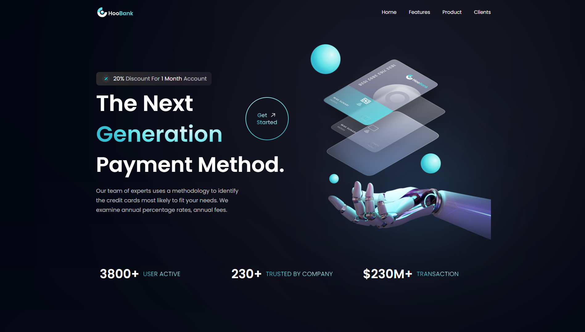

# 🚀 HooBank - A Modern Business Website

This site was developed to improve my knowledge and UI/UX concepts. It's a project led by [Adrian](https://github.com/adrianhajdin), from the [JavaScript Mastery](https://www.youtube.com/@javascriptmastery) channel, who guides us throughout the development, explaining all the concepts used in a simple and practical way.

 

# 🛠️ Built with

* Design in [Figma Project](https://www.figma.com/file/bUGIPys15E78w9bs1l4tgS/HooBank?type=design&node-id=310-485&mode=design&t=24zm56RItQBysTMU-0)
* [React](https://reactjs.org/) 
* [Tailwind CSS](https://tailwindcss.com/)
